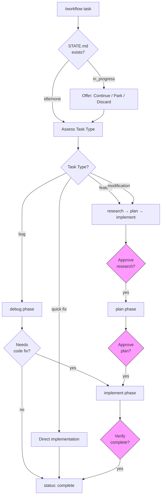
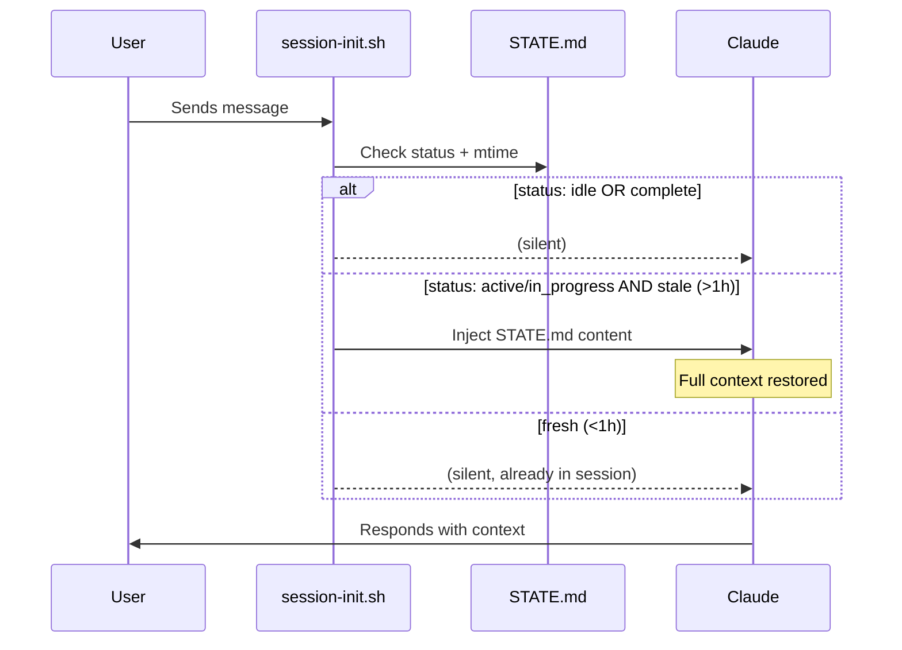
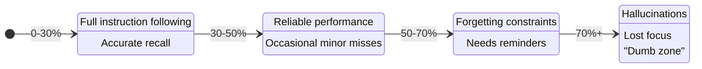
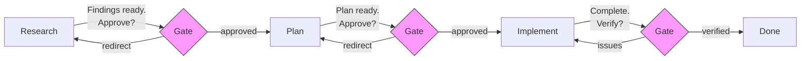

# Workflow System Guide

A structured approach to non-trivial tasks that prevents cascading errors through phased execution with approval gates.

## Why This Workflow Exists

**Error impact scales by phase:**

```
Research errors  →  cascade 1000x  →  one flawed assumption = thousands of bad code lines
Planning errors  →  cascade 100x   →  one bad step = hundreds of bad lines
Code errors      →  localized      →  fix is contained
```

Human review has highest leverage early, not at code review. This workflow front-loads validation where it matters most.

**The alternative — "vibe coding":**
- Jump straight to implementation
- Discover misunderstandings mid-way
- Rework or abandon work
- Context wasted on dead ends

---

## How It Works

### Orchestration Flow



### Task Type Routing

| Signals in Request | Task Type | Path |
|-------------------|-----------|------|
| "not working", "error", "bug", "broken" | Bug | `debug` → (implement if needed) |
| "add", "implement", "create", "build" | Feature | `research` → `plan` → `implement` |
| Clear, small, single-file change | Quick Fix | Direct (no phases) |
| "refactor", "change", "update" + multi-file | Modification | `research` → `plan` → `implement` |

**Why different paths?** A typo fix doesn't need research. A new feature does. The workflow matches rigor to risk.

---

## Session Continuity

### The Problem

Context is finite. Sessions end. Work must resume without loss.

**Principle:** "State lives in context" — but context resets each session. STATE.md bridges the gap.

### Session Reload Flow



### STATE.md Formats

**Simple format** (general context):
```markdown
## Session Notes

Working on feature X.

### Key Points
- Decision 1
- Decision 2

### Next
Continue with step 3
```

**Workflow format** (managed by /workflow):
```yaml
---
task: "Add user authentication"
status: in_progress
phase: implement
path: research,plan,implement
context_percent: 45
last_updated: 2026-01-22
---

## Decisions
- Using JWT (rationale: stateless, API-friendly)

## Key Files
- `src/auth/middleware.ts:42` — main handler

## Next Steps
Implement token refresh endpoint
```

**Rules:**
- Keep under 100 lines (forces prioritization)
- Focus on what's needed to resume, not history
- Delete resolved items aggressively

### Controlling Injection

| `status:` value | Behavior |
|-----------------|----------|
| (missing) | Inject if stale |
| `active` | Inject if stale |
| `in_progress` | Inject if stale |
| `idle` | Never inject |
| `complete` | Never inject |

Set `status: idle` when done with a task to suppress injection.

---

## Context Hygiene

### The Core Principle

> "Context is the only lever—treat it deliberately."

Even with large context windows, small focused prompts outperform large diluted ones. Quality degrades predictably as context fills.

### Quality Degradation Curve



### The Utilization Table

| Utilization | Quality | Action |
|-------------|---------|--------|
| 0-30% | Peak | Proceed freely |
| 30-50% | Good | Proceed normally |
| 50-60% | Degrading | Warn user, proceed with caution |
| 60%+ | Poor | **STOP** — run `/checkpoint` then `/compact` |

### The "Dumb Zone" (70%+)

**Symptoms when context exceeds ~75k tokens:**
- Hallucinating libraries that don't exist
- Forgetting established constraints
- Missing obvious bugs
- "Context-anxious" behaviors (aggressive truncation)

**Why this happens:** The model's attention spreads thin. Early instructions fade. Recent noise dominates.

**Prevention:**
```bash
# Check utilization
.claude/skills/shared/scripts/read-metrics.sh used_percentage

# If approaching 60%, save state
/checkpoint

# Then compact
/compact
```

### Workflow Enforcement

The workflow skill enforces context hygiene automatically:

1. **Pre-flight check** before each phase
2. **Hard gate at 60%** — phase won't start until compacted
3. **Mid-phase monitoring** during implementation (every 3-5 steps)

---

## Phase Gates

### Why Gates Matter

> "Human review has highest leverage early, not at code review."

Gates prevent runaway execution. They catch misunderstandings before they cascade.



### Gate Format

Each phase ends with:

```markdown
## Ready for [Next Phase]

### Summary
What was accomplished

### Key Decisions
Choices made and why

### Risks/Concerns
What might go wrong

### Approval Request
"Approve to proceed?" / "Please verify."
```

### Deviation Rules

During implementation, deviations from plan are handled by severity:

| Condition | Action |
|-----------|--------|
| Minor syntax/typo fixes | Auto-fix, continue |
| Missing import/dependency | Add it, continue |
| Small refactor (<5 lines) | Do it, continue |
| **Architectural change needed** | **STOP**, explain, get approval |

**The key distinction:** Rules 1-3 are mechanical adjustments. Rule 4 requires human judgment because it changes the plan's assumptions.

---

## Example: Adding a Feature

A concrete walkthrough of the full workflow.

### Request
> "Add a dark mode toggle to the settings page"

### Phase 1: Assessment

```
/workflow Add a dark mode toggle to the settings page
```

**Task Assessment:**
- **Type:** Feature
- **Scope:** Medium (UI + state + persistence)
- **Path:** research → plan → implement

*User approves*

### Phase 2: Research

**Findings:**
- Settings page: `src/pages/Settings.tsx`
- Existing theme: CSS variables in `src/styles/theme.css`
- State management: React Context in `src/context/`
- No existing dark mode infrastructure

**Exit:** "Research complete. Ready to plan?"

*User approves*

### Phase 3: Plan

```markdown
## Phase 1: Theme Infrastructure
- [ ] Add dark theme CSS variables to theme.css
- [ ] Create ThemeContext with toggle function

## Phase 2: Settings UI
- [ ] Add toggle component to Settings.tsx
- [ ] Wire to ThemeContext

## Phase 3: Persistence
- [ ] Save preference to localStorage
- [ ] Load on app init
```

**Exit:** "Plan ready. Approve to proceed?"

*User approves*

### Phase 4: Implement

Execute steps, verify each:

```markdown
## Phase 1 Complete
- [x] Dark theme CSS variables added
- [x] ThemeContext created
- Verified: Theme toggles in React DevTools

## Phase 2 Complete
- [x] Toggle added to Settings
- [x] Wired to context
- Verified: Click toggles theme visually

## Phase 3 Complete
- [x] localStorage persistence
- [x] Load on init
- Verified: Refresh preserves preference
```

**Exit:** "Implementation complete. Please verify."

*User tests, confirms*

### Completion

STATE.md updated:
```yaml
status: complete
phase: idle
```

---

## Quick Reference

### Commands

| Command | When to Use | What It Does |
|---------|-------------|--------------|
| `/workflow` | Starting any non-trivial task | Assesses task, routes to phases, manages state |
| `/research` | Need to understand before acting | Explores codebase, surfaces findings |
| `/plan` | Ready to define implementation | Creates step-by-step plan for approval |
| `/implement` | Plan approved | Executes plan with verification |
| `/debug` | Something is broken | Systematic diagnosis before fixes |
| `/checkpoint` | Before breaks, at 50%+ context | Saves state to STATE.md |
| `/summarize` | Before `/compact` | Prepares context for compaction |
| `/compact` | Context heavy (60%+) | Reduces context while preserving state |
| `/cost` | Quick context check | Shows current utilization |

### Context Thresholds

| % | Zone | Action |
|---|------|--------|
| <50% | Safe | Work freely |
| 50-60% | Caution | Consider checkpoint |
| 60%+ | Stop | Must compact before continuing |

### STATE.md Statuses

| Status | Meaning | Hook Behavior |
|--------|---------|---------------|
| `active` / `in_progress` | Work ongoing | Inject if stale |
| `idle` / `complete` | Work finished | Never inject |
| `blocked` | Waiting on something | Inject if stale |
| `parked` | Paused for other work | Inject if stale |
